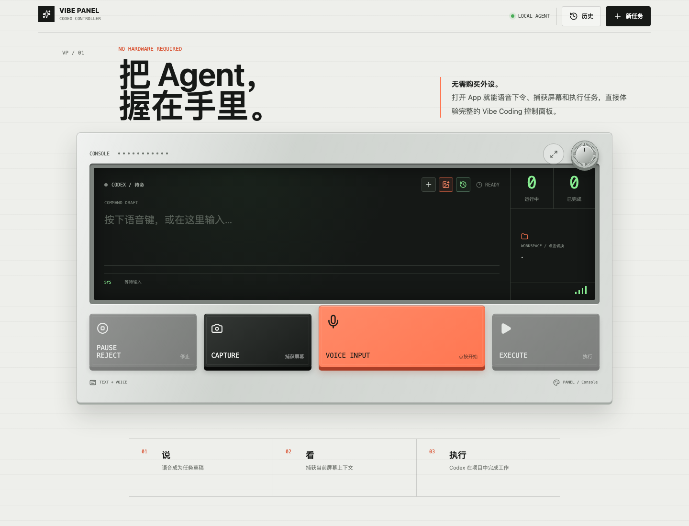
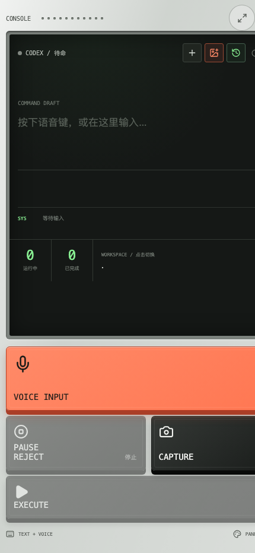

# Vibe Coding Panel

Vibe Coding Panel is a voice-first control surface for coding agents. It turns the small set of actions people use most often into a tactile, mobile-friendly panel: speak, add visual context, choose a workspace, run, stop, and inspect the result.

The app is designed for a simple boundary: the panel is the client, while the coding agent runs on the computer you control. It supports a no-login demo mode, a local Codex CLI agent, and an advanced remote Bridge.

## Runtime screenshots

These screenshots are captured from the running Vibe Panel app in demo-ready local mode.

<p align="center">
  
</p>
<p align="center">
  
</p>

## What is included

- No-login demo mode that simulates a task without reading files or running commands.
- Local Codex CLI execution with live progress, follow-up tasks, history, and refresh recovery.
- Voice input sent to local Whisper (`small` by default), with a system-recording fallback.
- Image upload on every device; desktop screen capture where the browser supports it.
- Directory browser for local or remote workspaces.
- Eight selectable key layouts plus four independent color themes.
- Installable HTTPS PWA for phone and desktop.
- One-time pairing codes, expiring after 10 minutes, persistent device authorization, and device revocation.

## Quick start

Requirements: Node.js 20+, a working `codex` CLI for real tasks, and a completed Codex login on the computer that runs the agent.

```bash
npm install
npm run dev
```

Open `http://localhost:5178`. Without a local agent, choose **演示** in Settings to try the panel immediately. For real tasks, choose **本机** and run the API on the same computer.

Production mode serves the built PWA and API from one origin:

```bash
npm run build
npm start
```

Open `http://127.0.0.1:8787` on the agent computer.

## Use it from a phone

The public Beta flow is intended to use an HTTPS reverse proxy or tunnel that you control. The included helper uses an ephemeral Cloudflare Tunnel:

```bash
npm run build
npm run share
```

Install `cloudflared` first. The command prints an HTTPS URL. On the agent computer, open the local panel, open Settings, enter that HTTPS URL under **手机配对**, and generate a pairing code or QR code. Scan the QR code on the phone, or enter the one-time code. The code expires after 10 minutes and can only be used once.

For a stable deployment, put the app behind your own HTTPS reverse proxy and set `PANEL_REQUIRE_PAIRING=1`. Do not expose the API or Bridge directly to the public Internet.

After pairing, the phone receives an HttpOnly device cookie. From the local Settings panel you can see authorized devices and revoke any device immediately. Revocation invalidates that device's cookie.

## Remote Agent Bridge

The default local API listens only on loopback. To run the agent on another computer, start a Bridge there with a long random token:

```bash
PANEL_BRIDGE_HOST=0.0.0.0 \
PANEL_BRIDGE_PORT=8788 \
PANEL_BRIDGE_TOKEN='replace-with-a-long-random-token' \
PANEL_AGENT_NAME='Studio Mac' \
npm start
```

Use the advanced **远程** connection mode in Settings and provide the Bridge HTTPS address, token, and remote workspace. Tailscale or WireGuard is recommended for this advanced path. The public Beta pairing flow does not replace the Bridge token; it protects access to the panel itself.

## Voice transcription

The browser records one complete audio clip, then the computer running the app sends it to Whisper. The first `small` model download is about 461 MB.

```bash
PANEL_WHISPER_BIN=/path/to/whisper \
PANEL_WHISPER_MODEL=small \
PANEL_WHISPER_TIMEOUT_MS=180000 \
npm start
```

Set `PANEL_FFMPEG_BIN` when ffmpeg is not available through Python `imageio_ffmpeg`. Audio is not uploaded to a Vibe Panel cloud service.

## Configuration

| Variable | Default | Purpose |
| --- | --- | --- |
| `PANEL_API_PORT` | `8787` | Local API and production web port |
| `PANEL_REQUIRE_PAIRING` | unset | Require a paired device for non-loopback API requests |
| `PANEL_DEVICE_STORE` | `~/.vibe-panel/devices.json` | Device authorization store; keep it private |
| `PANEL_BRIDGE_HOST` | `127.0.0.1` | Remote Bridge bind address |
| `PANEL_BRIDGE_PORT` | `8788` | Remote Bridge port |
| `PANEL_BRIDGE_TOKEN` | unset | Enables and protects the Bridge |
| `PANEL_AGENT_NAME` | machine hostname | Name shown in the panel |
| `PANEL_WHISPER_BIN` | `whisper` | Whisper executable |
| `PANEL_WHISPER_MODEL` | `small` | Whisper model |
| `PANEL_WHISPER_TIMEOUT_MS` | `180000` | Transcription timeout |

## Privacy and security

Vibe Coding Panel has no hosted task backend. In local mode, prompts, recordings, images, and task output stay on the computer running the app. In remote mode, they travel to the Bridge you configure. The app stores task history and visual preferences in the browser's local storage; device authorization hashes are stored in the local device store and raw device tokens are never written to disk.

An HTTPS tunnel or reverse proxy can observe traffic according to its own policy. Use a provider you trust, keep pairing enabled, rotate Bridge tokens, and revoke devices that you no longer recognize. This project is not affiliated with or endorsed by OpenAI or Codex.

## Development

```bash
npm test
npm run check
npm run build
```

See [CONTRIBUTING.md](CONTRIBUTING.md), [SECURITY.md](SECURITY.md), and [docs/brand-led-release-route.md](docs/brand-led-release-route.md) for project boundaries and release context.

## License

MIT. See [LICENSE](LICENSE).
