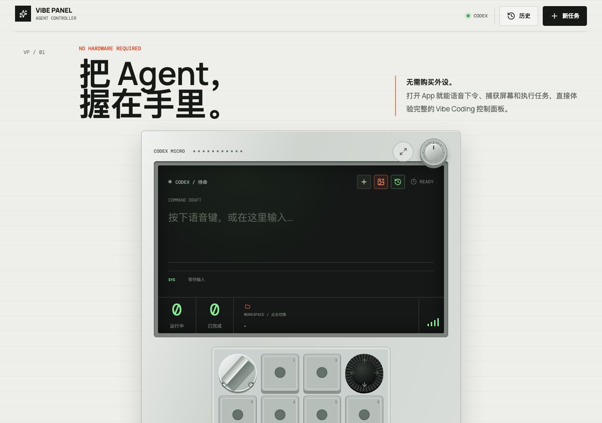
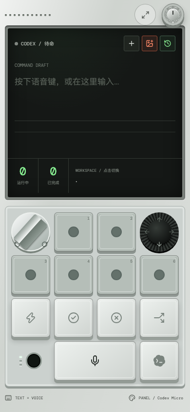

# Vibe Coding Panel

[简体中文](README.zh-CN.md) · [Website](https://vibe.tooluse.app/) · [Try the panel](https://vibe.tooluse.app/app)

Control your computer's Codex or Claude Code from your phone. Speak a request, choose a workspace, press a large key, and watch the result. No hardware required.

No Vibe Panel account, personal server, Tailscale, or tunnel setup is needed. The Connector runs on your computer and connects to the shared Relay at `https://vibe.tooluse.app`. Your agent keeps using its existing login and model provider.

## Install with your Agent

Paste this into Codex, Claude Code, or another coding agent **running on your computer**:

```text
Install and start Vibe Coding Panel on this computer.
Repository: https://github.com/x2v-co/vibe-coding-panel
Read docs/install-for-agents.md in the downloaded checkout and follow it.
Reuse my existing agent login and model/provider settings. Set up local
Whisper voice input if possible; report separately if it is unavailable.
Verify the Connector is online, then show me the phone pairing QR/link
and how to stop and restart it. Leave account login and phone microphone
permission to me. Do not report success until you have checked the service.
```

[Agent installation guide](docs/install-for-agents.md) covers platform checks, commands, existing installations, verification, and handoff.

## Portable download

[Download a portable Connector](https://vibe.tooluse.app/download) for macOS Apple Silicon/Intel, Windows x64 or Linux x64. Node.js 24 and locked application dependencies are included: extract the ZIP and run the platform launcher without installing Node or npm. An installed, authenticated Codex/Claude CLI is still required; Whisper/ffmpeg are optional for voice. Packages are unsigned internal-beta builds. [Package instructions and limitations](docs/portable-connector.md) · [Releases and checksums](https://github.com/x2v-co/vibe-coding-panel/releases/latest).

## Install from source

**Before you start:** use macOS, Windows 10/11, or Linux with [Node.js 24 LTS](https://nodejs.org/en/download). Install and sign in to [Codex CLI](https://developers.openai.com/codex/cli/) or [Claude Code](https://code.claude.com/docs/en/setup). Send a short text request in that CLI first to confirm it works.

1. **Download and extract** the [project ZIP](https://github.com/x2v-co/vibe-coding-panel/archive/refs/heads/main.zip). Open the extracted folder, not the ZIP.
2. **Start on your computer** using the launcher below. It installs Node dependencies on first launch.
3. **Scan the terminal QR code** with your phone camera. Open the link in Safari, Chrome, or Edge, then choose your Agent and workspace. Try a text request first.

| Computer | Start |
| --- | --- |
| macOS | Double-click `Vibe Panel.command` |
| Windows | Double-click `Vibe Panel.bat` |
| Linux | In the extracted folder, run `npm install`, then `npm run connect` |

Keep the terminal open and the computer awake. The phone can use a different network. Pairing codes expire after 10 minutes and can be used once; an already paired browser normally stays authorized.

Prefer a terminal? With Git installed, run:

```bash
git clone https://github.com/x2v-co/vibe-coding-panel.git
cd vibe-coding-panel
npm install
npm run connect
```

If the downloaded copy has no launcher or reports `Missing script: "connect"`, it is an older package. See [troubleshooting](#troubleshooting); do not create an empty replacement script.

## Enable voice input

Text input requires no speech dependencies. In portable packages, open
`Setup Voice.command` (macOS), `Setup Voice.bat` (Windows), or run
`bash "Setup Voice.sh"` (Linux). Source users can run:

```bash
node scripts/launch.mjs --setup-voice
```

Setup installs managed Python 3.11, Whisper, ffmpeg and a verified small model
without changing system Python. Allow about 3 GB of disk space and several
minutes for downloads, then restart the Connector. Explicit manual MLX/Whisper
settings take priority. See [package instructions](docs/portable-connector.md)
and [advanced configuration](docs/configuration.md).

Allow the site's microphone on your phone, tap **VOICE INPUT**, speak, and tap
again to finish. Automatic correction calls the configured Claude model service
before SEND and fills the existing editable draft. Edit it directly if needed;
failed correction keeps the raw text. Press **SEND** to execute the task. If
browser recording fails, use the system audio upload option.

## Choose an Agent

Select Codex or Claude Code in the phone panel. To remember a default for double-click launches, create `.vibe-panel/connector.json` in the project:

```json
{"agentProvider":"claude"}
```

Use `codex` to switch back. This file is ignored by Git. `PANEL_AGENT_PROVIDER`, if set, takes precedence. Panel uses the CLI's existing credentials and provider configuration; CLI authentication failures must be resolved there.

## Runtime screenshots

<p align="center">
  
  
</p>

## Features and limits

### Continue a terminal session

Choose the same **Workspace** and **Agent** used in your terminal, open **History → Native sessions**, and select a conversation. The panel reads saved messages every three seconds. Workspace matching is exact (a parent folder does not include subprojects).

To send a follow-up, exit that session in the terminal, confirm the handoff in the panel, enter your message, and press **Send and resume**. The CLI resumes the original session ID with its existing configuration. To return to your terminal, wait for the panel turn to finish and run the displayed `codex resume <id>` or `claude --resume <id>` command from that workspace.

This synchronizes saved conversation history and supports handoff; it does not mirror or control an already-open terminal. Occupied sessions are blocked when detected, but the acknowledgement is still required because CLI versions and operating systems expose different process metadata. Keep only one writer per session. Codex discovery requires a CLI with `app-server` `thread/list` and `thread/read`; Claude discovery reads local project transcripts (`CLAUDE_CONFIG_DIR` is respected). Relay and direct/local connections use the computer's Connector; the legacy Remote Bridge mode currently exposes Panel tasks only. Update and restart the Connector to enable this feature.

- Large controls, mobile focus mode, text/voice input, image uploads, and workspace directory selection.
- Codex and Claude Code tasks with live output, stop, follow-up, and browser history.
- Eight key layouts, four color themes, and custom Micro key actions, labels, colors, and SVG icons.
- [Micro controls and official-documentation mapping](docs/micro-controls.md): task-light meanings, assignment modes, configurable joystick and dial, and supported action candidates.
- Micro voice key: hold to talk and release to transcribe; double-tap within 350 ms to latch recording, then press again to stop.
- Demo mode and installable HTTPS PWA. Demo mode does not execute real tasks.
- One-time pairing and device revocation from local Settings.

Micro's native Fast mode, approval/decline, session fork, and plan mode are not implemented by the current CLI adapter. Those controls report their limits. Screen capture depends on desktop browser support; phones can upload images. Browser history does not guarantee session recovery after a Connector restart.

## Troubleshooting

| Symptom | What to do |
| --- | --- |
| Launcher will not open on macOS | Open Terminal in the extracted folder and run `bash "Vibe Panel.command"`. |
| `node` / `npm` not found | Install Node.js 24 LTS, close and reopen the terminal, then retry. |
| `Missing script: "connect"` | Confirm the folder's `package.json` contains a `connect` script. Download a current Connector package; if the published copy still lacks it, report the packaging issue. |
| No Agent ready / authorization error | Run `codex` or `claude` directly and confirm a real text request succeeds. Panel reuses that configuration. |
| Phone says Connector offline | Keep the Connector running and the computer awake; wait for “电脑 Connector 已连接”, then scan its QR code. |
| QR code expired | Restart the Connector to get a fresh code. Existing paired browsers do not need to pair again. |
| Whisper or ffmpeg missing | Complete the voice setup above and restart. A Python virtual environment does not need activation. |
| Voice changes are not visible | Finish any running task, restart the computer Connector, and reload the phone page. |

## Privacy

The Agent and Whisper run on your computer. With the default shared Relay, prompts, recordings, images, and results pass through that Relay in memory; the Relay implementation does not persist those payloads. This is **not end-to-end encryption**: trust the Relay operator, or [host your own](docs/relay-deployment.md). Your model provider still receives the data sent by your Agent.

Preferences and demo history are stored in the browser. Panel tasks are shared through the computer Connector's memory. Native conversation files stay under their CLI's local storage; reading a session sends its visible messages through the chosen connection. Device authorization hashes stay on the computer; pairing cookies authorize the phone. Revoke unrecognized devices in local Settings. See [SECURITY.md](SECURITY.md).

## Advanced use and development

For local-only use, Tailscale/Bridge, or environment variables, see [configuration](docs/configuration.md). Server operators can use the [Relay deployment guide](docs/relay-deployment.md). Normal users can use the shared Relay.

```bash
npm run dev
npm test
npm run check
npm run build
```

Development: open the Vite URL printed in the terminal (normally `http://localhost:5178`). This is separate from the phone Connector flow.

[Contributing](CONTRIBUTING.md) · [Changelog](CHANGELOG.md) · [Product/release context](docs/brand-led-release-route.md) · [MIT license](LICENSE)

Not affiliated with or endorsed by OpenAI, Codex, Anthropic, or Claude Code.

## Release readiness

See [startup diagnostics, cross-platform acceptance, Relay limits and release/rollback operations](docs/release-operations.md).

The four release-infrastructure workstreams are implemented and CI-verified.
Android PWA core acceptance and both agents' handoff to the tested Mac passed.
iPhone Safari core flows passed; remaining iPhone checks are paused. See
[physical-device results and remaining limits](docs/known-issues.md) for exact
devices and coverage. Distribution remains internal beta.

Release information: [Changelog](CHANGELOG.md) · [Known limitations](docs/known-issues.md) · [Privacy notice (Chinese)](https://vibe.tooluse.app/privacy/) · [Terms (Chinese)](https://vibe.tooluse.app/terms/).
